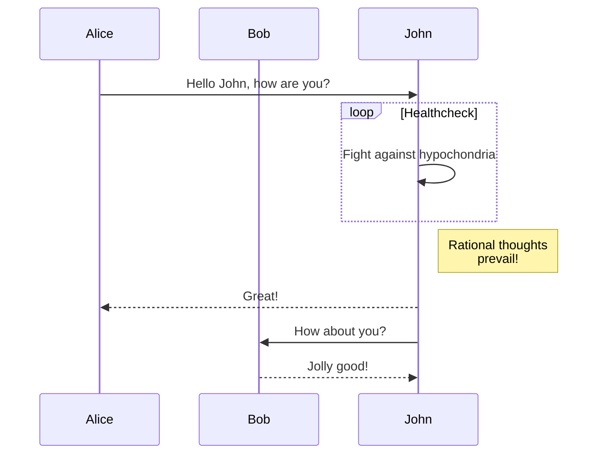
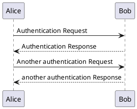

### 脚注

> 引用

```html
<script src="//cdn.jsdelivr.net/npm/docsify-footnote/dist/docsify-footnote.min.js"></script>
```

tf[^1]

[^1]: Test File

### 代码复制

```java
Hello
```


### 数学公式

$$
\sqrt{x}
$$

### 页签

```
<!-- tabs:start -->

#### **English**

Hello!

#### **French**

Bonjour!

#### **Italian**

Ciao!

<!-- tabs:end -->

```


<!-- tabs:start -->

#### **English**

Hello!

#### **French**

Bonjour!

#### **Italian**

Ciao!

<!-- tabs:end -->


### 提示

https://github.com/fzankl/docsify-plugin-flexible-alerts

> [!NOTE]
> An alert of type 'note' using global style 'callout'.

> [!TIP]
> An alert of type 'tip' using global style 'callout'.

> [!WARNING]
> An alert of type 'warning' using global style 'callout'.

> [!ATTENTION]
> An alert of type 'attention' using global style 'callout'.

> [!NOTE|label: 自定义标签]
> An alert of type 'note' using global style 'callout'.


### 思维图表

https://github.com/zuisong/docsify-kroki

https://zuisong.github.io/docsify-kroki

kroki

> 思维导图




> UML




> BPMN

```bpmn
<?xml version="1.0" encoding="UTF-8"?>
<bpmn:definitions xmlns:xsi="http://www.w3.org/2001/XMLSchema-instance" xmlns:bpmn="http://www.omg.org/spec/BPMN/20100524/MODEL" xmlns:bpmndi="http://www.omg.org/spec/BPMN/20100524/DI" xmlns:dc="http://www.omg.org/spec/DD/20100524/DC" xmlns:di="http://www.omg.org/spec/DD/20100524/DI" id="Definitions_1" targetNamespace="http://bpmn.io/schema/bpmn">
  <bpmn:process id="Process_1" isExecutable="false">
    <bpmn:startEvent id="StartEvent_1" name="开始节点">
      <bpmn:outgoing>Flow_0husznx</bpmn:outgoing>
    </bpmn:startEvent>
    <bpmn:userTask id="Activity_0jy6ksz" name="学术理论部审核">
      <bpmn:incoming>Flow_0husznx</bpmn:incoming>
      <bpmn:outgoing>Flow_0qjwrxp</bpmn:outgoing>
    </bpmn:userTask>
    <bpmn:exclusiveGateway id="Gateway_04ix1uf" name="排他网关节点">
      <bpmn:incoming>Flow_0qjwrxp</bpmn:incoming>
      <bpmn:outgoing>Flow_0m1teri</bpmn:outgoing>
      <bpmn:outgoing>Flow_1tgr8bv</bpmn:outgoing>
    </bpmn:exclusiveGateway>
    <bpmn:sequenceFlow id="Flow_0qjwrxp" sourceRef="Activity_0jy6ksz" targetRef="Gateway_04ix1uf" />
    <bpmn:sequenceFlow id="Flow_0husznx" sourceRef="StartEvent_1" targetRef="Activity_0jy6ksz" />
    <bpmn:sequenceFlow id="Flow_0m1teri" sourceRef="Gateway_04ix1uf" targetRef="Activity_1x347hs" />
    <bpmn:userTask id="Activity_1x347hs" name="学院A审核">
      <bpmn:incoming>Flow_0m1teri</bpmn:incoming>
      <bpmn:outgoing>Flow_1umc1g9</bpmn:outgoing>
    </bpmn:userTask>
    <bpmn:userTask id="Activity_1lijhw5" name="学院B审核">
      <bpmn:incoming>Flow_1tgr8bv</bpmn:incoming>
      <bpmn:outgoing>Flow_0ns13hc</bpmn:outgoing>
    </bpmn:userTask>
    <bpmn:sequenceFlow id="Flow_1tgr8bv" sourceRef="Gateway_04ix1uf" targetRef="Activity_1lijhw5" />
    <bpmn:endEvent id="Event_1ahuvo8" name="结束节点">
      <bpmn:incoming>Flow_1umc1g9</bpmn:incoming>
      <bpmn:incoming>Flow_0ns13hc</bpmn:incoming>
    </bpmn:endEvent>
    <bpmn:sequenceFlow id="Flow_1umc1g9" sourceRef="Activity_1x347hs" targetRef="Event_1ahuvo8" />
    <bpmn:sequenceFlow id="Flow_0ns13hc" sourceRef="Activity_1lijhw5" targetRef="Event_1ahuvo8" />
  </bpmn:process>
  <bpmndi:BPMNDiagram id="BPMNDiagram_1">
    <bpmndi:BPMNPlane id="BPMNPlane_1" bpmnElement="Process_1">
      <bpmndi:BPMNEdge id="Flow_0ns13hc_di" bpmnElement="Flow_0ns13hc">
        <di:waypoint x="670" y="210" />
        <di:waypoint x="726" y="210" />
        <di:waypoint x="726" y="120" />
        <di:waypoint x="812" y="120" />
      </bpmndi:BPMNEdge>
      <bpmndi:BPMNEdge id="Flow_1umc1g9_di" bpmnElement="Flow_1umc1g9">
        <di:waypoint x="670" y="40" />
        <di:waypoint x="726" y="40" />
        <di:waypoint x="726" y="120" />
        <di:waypoint x="812" y="120" />
      </bpmndi:BPMNEdge>
      <bpmndi:BPMNEdge id="Flow_1tgr8bv_di" bpmnElement="Flow_1tgr8bv">
        <di:waypoint x="460" y="145" />
        <di:waypoint x="460" y="210" />
        <di:waypoint x="570" y="210" />
      </bpmndi:BPMNEdge>
      <bpmndi:BPMNEdge id="Flow_0m1teri_di" bpmnElement="Flow_0m1teri">
        <di:waypoint x="460" y="95" />
        <di:waypoint x="460" y="40" />
        <di:waypoint x="570" y="40" />
      </bpmndi:BPMNEdge>
      <bpmndi:BPMNEdge id="Flow_0husznx_di" bpmnElement="Flow_0husznx">
        <di:waypoint x="209" y="120" />
        <di:waypoint x="280" y="120" />
      </bpmndi:BPMNEdge>
      <bpmndi:BPMNEdge id="Flow_0qjwrxp_di" bpmnElement="Flow_0qjwrxp">
        <di:waypoint x="380" y="120" />
        <di:waypoint x="435" y="120" />
      </bpmndi:BPMNEdge>
      <bpmndi:BPMNShape id="_BPMNShape_StartEvent_2" bpmnElement="StartEvent_1">
        <dc:Bounds x="173" y="102" width="36" height="36" />
        <bpmndi:BPMNLabel>
          <dc:Bounds x="169" y="145" width="44" height="14" />
        </bpmndi:BPMNLabel>
      </bpmndi:BPMNShape>
      <bpmndi:BPMNShape id="Activity_1i1gglj_di" bpmnElement="Activity_0jy6ksz">
        <dc:Bounds x="280" y="80" width="100" height="80" />
        <bpmndi:BPMNLabel />
      </bpmndi:BPMNShape>
      <bpmndi:BPMNShape id="Gateway_04ix1uf_di" bpmnElement="Gateway_04ix1uf" isMarkerVisible="true">
        <dc:Bounds x="435" y="95" width="50" height="50" />
        <bpmndi:BPMNLabel>
          <dc:Bounds x="487" y="113" width="66" height="14" />
        </bpmndi:BPMNLabel>
      </bpmndi:BPMNShape>
      <bpmndi:BPMNShape id="Activity_1n8v0hc_di" bpmnElement="Activity_1x347hs">
        <dc:Bounds x="570" y="0" width="100" height="80" />
        <bpmndi:BPMNLabel />
      </bpmndi:BPMNShape>
      <bpmndi:BPMNShape id="Activity_0ks1h2h_di" bpmnElement="Activity_1lijhw5">
        <dc:Bounds x="570" y="170" width="100" height="80" />
        <bpmndi:BPMNLabel />
      </bpmndi:BPMNShape>
      <bpmndi:BPMNShape id="Event_1ahuvo8_di" bpmnElement="Event_1ahuvo8">
        <dc:Bounds x="812" y="102" width="36" height="36" />
        <bpmndi:BPMNLabel>
          <dc:Bounds x="808" y="145" width="44" height="14" />
        </bpmndi:BPMNLabel>
      </bpmndi:BPMNShape>
    </bpmndi:BPMNPlane>
  </bpmndi:BPMNDiagram>
</bpmn:definitions>

```


### 数学图表

https://github.com/markbattistella/docsify-charty


### 终端代码

```terminal
npm run start
$|npm run start
$|warning|npm run build
>|info|npm run start
 |...
>|error|npm run start
>|success|npm run start

warning|npm run build
```


### 代码高亮

```html
<script src="https://cdn.jsdelivr.net/npm/prismjs@1/components/prism-java.min.js"></script>
```


```java
public class RbacAuthConst {
    public static final String BAN_CODE = "lucy-rbac-ban:";
}

```

